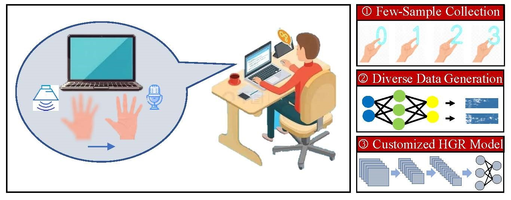
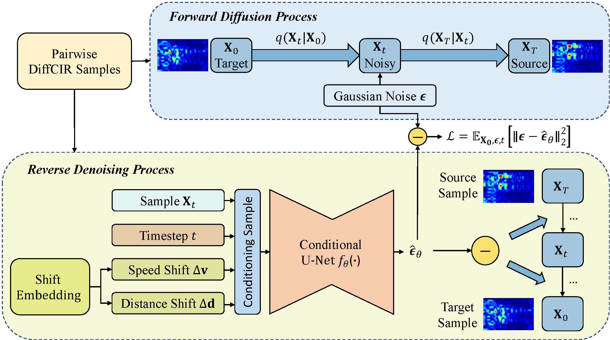

# UltraPose

UltraPose is a few-shot ultrasonic gesture recognition framework based on diversity-aware data synthesis. Instead of training a fixed few-shot classifier directly from a handful of real samples, UltraPose learns to generate diverse virtual ultrasonic samples, then lets users train a gesture classifier that fits their own device budget.

The key idea is that intra-class gesture diversity is mainly shaped by two physical factors:

- **Gesture speed**, reflected by Doppler-related time-frequency changes.
- **Hand-to-transceiver distance**, reflected by propagation-delay changes in the ultrasonic channel.

UltraPose encodes the relative shifts of these two factors between gesture instances and uses them to condition **ShiftNet**, a supervised U-Net model for acoustic sensing data generation.

## Figure Highlights

**Customized few-shot sensing workflow.**



**ShiftNet condition injection and generation architecture.**



## Paper

This repository accompanies:

**Few-shot Ultrasonic Gesture Recognition via Diversity-aware Data Generation**

The paper studies few-shot ultrasonic human gesture recognition (HGR) on commodity audio devices. In the reported experiments, UltraPose achieves **86.0%**, **89.5%**, and **96.0%** accuracy under 2-shot, 4-shot, and 6-shot settings, respectively, outperforming prior few-shot acoustic HGR methods and a wireless data synthesis baseline.

## Repository Contents

```text
.
|-- dataset.py                     # Gen dataset for paired source/target samples and shift conditions
|-- model.py                       # Conditioned U-Net / ShiftNet backbone
|-- train.py                       # Training entry point
|-- utils.py                       # Model save/load helpers
|-- preprocess/
|   `-- gen_train_dataset.py       # Builds paired .npy training data from .mat ultrasonic features
|-- figure/                        # Paper figures and editable figure sources
|-- requirements.txt               # Original environment export
`-- README.md
```

This release focuses on the data-preparation and ShiftNet training pipeline. Signal acquisition, classifier training/evaluation.

## License

This project is released under the MIT License. See `LICENSE` for details.
